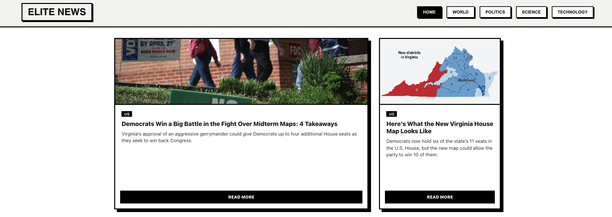

<h1 align= "center">  📰 Elite News 📰</h1>

<p align="center">
  <b>A bold New York Times-inspired news experience built with React, Axios, and Context API.</b>
</p>

<p align="center">
  <a href="https://nyt-clone-react.vercel.app/">
    
  </a>
  <a href="https://github.com/gcangemi1997-coder/nyt-clone-react">
    
  </a>
  <a href="https://developer.nytimes.com/docs/top-stories-product/1/overview">
    
  </a>
</p>

<p align="center">
  
  
  
  
  
  
</p>

---

## 📸 Screenshots



---

## ✨ Overview

**Elite News** is a frontend project inspired by the structure of the New York Times homepage.  
It fetches live articles from the **New York Times Top Stories API** and displays them in a responsive editorial-style layout with category navigation and dedicated article detail views.

The app combines **real API integration**, **clean component architecture**, and a **strong visual identity** to deliver a modern reading experience.

---

## 🎯 Project Goal

The purpose of this project is to recreate a newspaper-like homepage using dynamic content from the New York Times API.  
Users can browse different news sections, switch categories from the navigation bar, and open a full article detail page with key information and a direct source link.

The New York Times Top Stories API provides access to featured articles from multiple sections through endpoints such as `/{section}.json`.

---

## 🌈 Main Features

- 🗞️ Real-time news fetched from the New York Times API
- 🧭 Category navigation for multiple sections
- 📄 Dedicated article detail page
- ⚛️ Reusable React components
- 🔄 Client-side routing with React Router
- 🧠 Global state management with Context API
- 🚀 Axios-based API requests
- ⏳ Loading state with skeleton cards
- ⚠️ Error handling for failed requests
- 📱 Responsive layout for desktop and mobile
- 🎨 Custom visual style using CSS Modules

---

## 🏷️ Tech Badges

<p align="left">
  
  
  
  
  
  
  
  
  
  
  
  
</p>

## 🛠️ Tech Stack

### Languages

- HTML5
- CSS3
- JavaScript (ES6+)

### Libraries & Tools

- React
- React DOM
- React Router DOM
- Axios
- Vite

### React Concepts Used

- Functional Components
- Props
- `useState`
- `useEffect`
- `useContext`
- `createContext`
- Custom Hook
- Conditional Rendering
- Dynamic Routing
- Shared Global State

---

---

## 🔌 API Used

This project uses the **New York Times Top Stories API**, which returns article lists and related images for the selected section front.

### Base URL

```bash
https://api.nytimes.com/svc/topstories/v2
```

```

```

### Example endpoints

```bash
/home.json
/world.json
/politics.json
/science.json
/technology.json
```

The official NYT API overview explains that articles are retrieved by sending a GET request to the endpoint for the desired section.

To use the app, you need a personal API key from the NYT Developer portal.
👉 https://developer.nytimes.com/get-started

---

## ⚙️ Installation

### 1. Clone the repository

```bash
git clone https://github.com/your-username/elite-news.git
```

### 2. Move into the project folder

```bash
cd elite-news
```

### 3. Install dependencies

```bash
npm install
```

### 4. Create a `.env` file

Inside the project root, add your API key:

```env
VITE_NYT_API_KEY=your_api_key_here
```

### 5. Start the dev server

```bash
npm run dev
```

---

## 📂 Project Structure

```bash
src/
│
├── components/
│   ├── Navbar/
│   │   ├── Navbar.jsx
│   │   └── Navbar.module.css
│   │
│   └── ArticleCard/
│       ├── ArticleCard.jsx
│       └── ArticleCard.module.css
│
├── context/
│   └── NewsContext.jsx
│
├── data/
│   └── api.js
│
├── pages/
│   ├── Home.jsx
│   └── ArticleDetail/
│       ├── ArticleDetail.jsx
│       └── ArticleDetail.module.css
│
├── styles/
│   ├── App.css
│   └── index.css
│
├── App.jsx
└── main.jsx
```

---

## 🧱 Architecture

The application is built with a modular structure that separates routing, state management, API logic, and UI components

- **App.jsx** handles the main routes using React Router
- **main.jsx** renders the app and wraps it with the global provider
- **NewsContext.jsx** stores articles, loading, error state, and the selected category
- **api.js** uses Axios to fetch data from the NYT API with the environment-based API key
- **Home.jsx** renders the list of articles, loading state, and error handling
- **ArticleDetail.jsx** displays the selected article and includes a fallback state if route data is missing after refresh

---

## ⚡ How It Works

1. The app starts with the `home` category selected by default
2. Whenever the category changes, the context triggers a new fetch request
3. Axios requests data from the NYT Top Stories API
4. Articles are stored in global state and rendered on the homepage
5. Clicking on a card navigates to the article detail page

---

## 🎨 UI Highlights

The project has a strong visual style with bold cards, interactive buttons, and a responsive news grid

### Some standout interface details:

- Sticky top navigation bar
- Active category button styling
- Article cards with hover effects and skeleton loading
- Responsive grid layout with featured spacing behavior
- Dedicated article detail layout with a clear back button and source link

---

## 📱 Responsive Design

The layout is designed to adapt across different screen sizes using responsive CSS rules and grid behavior.

The project includes:

- responsive navigation behavior
- flexible card layout
- readable typography and spacing
- mobile-friendly article detail view

---

## ✅ Strengths

- Clean React component structure
- Global state handled with Context API
- Axios API integration with environment-based API key
- Dynamic routing and article navigation
- Visible loading and error states
- Distinctive visual design with CSS Modules

---

## 🔮 Future Improvements

- Add a search feature
- Add a custom 404 page
- Improve persistence on refresh
- Add bookmarking or favorites
- Add dark mode
- Improve accessibility
- Add tests
- Add more categories from the NYT API, which supports sections such as arts, business, food, health, sports, technology, and world.

---

## 📚 What I Learned

This project helped me strengthen my skills in:

- working with external REST APIs
- managing asynchronous data with React Hooks
- organizing shared state with Context API
- building reusable UI components
- creating dynamic page navigation with React Router
- designing responsive frontend layouts

---

## 👨‍💻 Author

Built by **Giorgio Cangemi**.

---

## 📄 License

This project was created for educational purposes.  
All article content belongs to **The New York Times** and is delivered through their official API.
